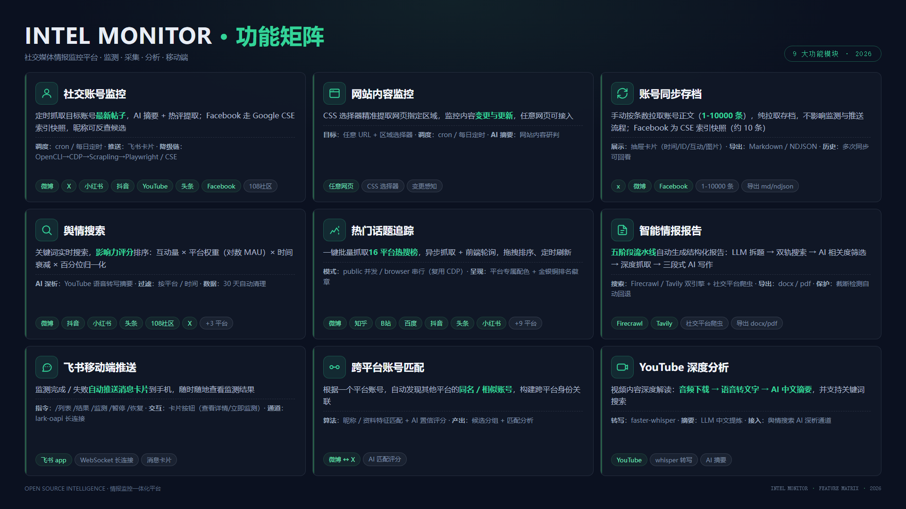
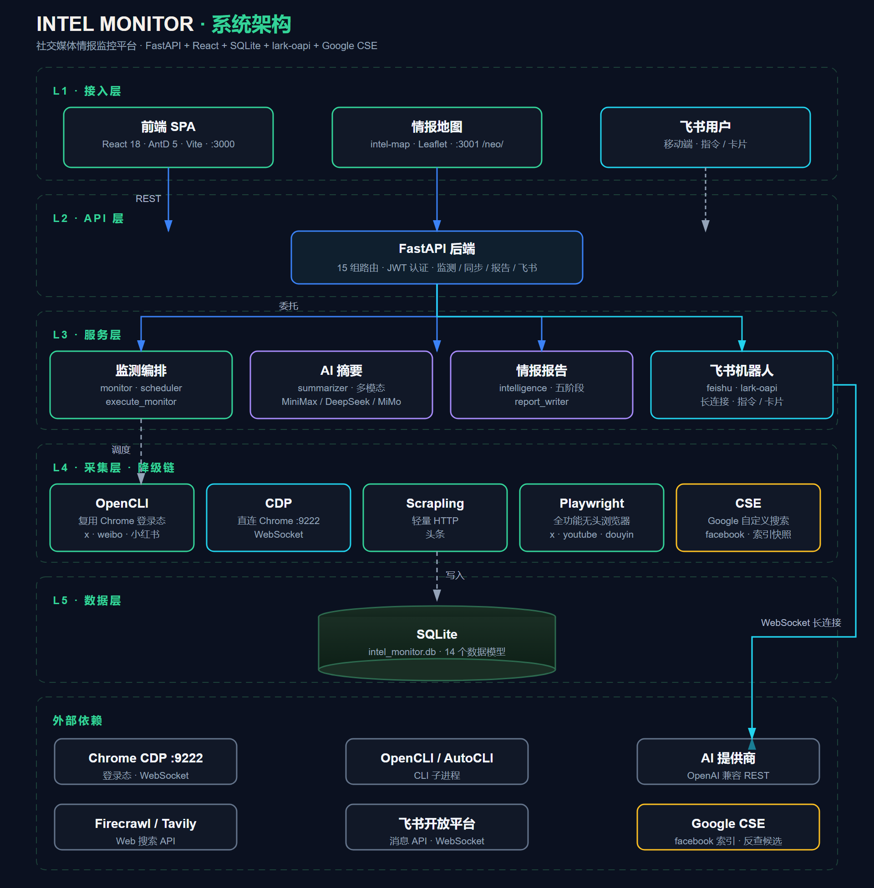

# Intel Monitor — 社交媒体与网站监控平台

自动化监控社交媒体账号动态和网站内容变化，多级爬虫降级链保障可用性，AI 驱动摘要、舆情分析和智能报告生成。支持飞书移动端推送与指令查询，随时随地在手机上查看监测结果。

## 核心亮点

- **五级爬虫降级链** — OpenCLI → CDP Proxy → Scrapling → Playwright，自动切换，最大限度保障爬取成功率
- **多模态 AI 摘要** — 支持 MiniMax / DeepSeek / MiMo 三家模型，自动识别帖子图片内容并生成中文摘要
- **多维影响力评分** — 互动量 × 平台权重 × 时间衰减 × 百分位归一化，科学排序舆情内容
- **五阶段情报报告** — LLM 拆题 → 双轨搜索 → 相关度过滤 → 深度抓取 → 三段式 AI 写作，自动生成结构化报告
- **跨平台舆情搜索** — 覆盖微博/抖音/小红书/头条/108社区/X/YouTube/Facebook/Telegram 九个平台
- **十六平台热搜追踪** — 一键批量抓取微博/知乎/B站/百度/抖音/头条/小红书/HackerNews/GitHub 等平台热搜
- **飞书移动端推送** — lark-oapi 长连接，监测完成自动推送到手机，支持 /绑定 /列表 /结果 /监测 等对话指令与卡片按钮
- **社交账号同步存档** — x/微博/Facebook 账号一键按条数拉取正文存档，抽屉展示并可导出 Markdown / NDJSON
- **Facebook 账号监测** — Google CSE 索引快照 + headless Playwright，无需登录态；昵称一键反查候选主页，监测与同步共用同一通道

## 功能矩阵



## 架构速览



## 快速启动

### 环境要求

- **Python** ≥ 3.10（开发使用 3.14）
- **Node.js** ≥ 18
- **Chrome** 浏览器（CDP 模式需要，可选）

### 三步启动

```bash
# 1. 后端
cd backend
pip install -r requirements.txt
python main.py
# → http://localhost:8000

# 2. 前端（新终端）
cd frontend
npm install
npm run dev
# → http://localhost:3000
```

首次访问前端会自动跳转到创建管理员账号页面。

> 💡 Windows 用户也可直接运行 `start.bat`，会自动检测 Chrome 并启动 CDP Proxy。

### Docker（可选）

> ⚠️ Docker 下 Playwright 和 CDP Proxy 需要额外配置 Chrome，推荐在宿主机直接运行以获得完整体验。

### 数据库迁移

项目不使用 Alembic，启动时自动检测并添加缺失的数据库列，无需手动执行迁移命令。数据库文件默认位于 `backend/data/intel_monitor.db`。

## 配置说明

在 `backend/` 目录下创建 `.env` 文件（参考 `.env.example`）：

### 基础配置

| 变量 | 说明 | 默认值 |
|------|------|--------|
| `HOST` | 后端监听地址 | `0.0.0.0` |
| `PORT` | 后端端口 | `8000` |
| `DATABASE_URL` | 数据库连接 | `sqlite+aiosqlite:///./data/intel_monitor.db` |
| `JWT_SECRET` | JWT 签名密钥 | 首次运行自动生成 |
| `JWT_EXPIRE_MINUTES` | 登录有效期（分钟） | `1440`（24小时） |

### AI 提供商（至少配置一个）

| 提供商 | API Key 变量 | 模型变量 |
|--------|-------------|----------|
| **MiniMax** | `MINIMAX_API_KEY` | `MINIMAX_MODEL`（默认 `MiniMax-M2.7`） |
| **DeepSeek** | `DEEPSEEK_API_KEY` | `DEEPSEEK_MODEL` |
| **MiMo**（小米） | `MIMO_API_KEY` | `MIMO_MODEL` |
| AI 提供商切换 | `AI_PROVIDER` | `minimax` / `deepseek` / `mimo` |

AI 摘要提示词可通过 Web 界面或 `/api/settings/prompts` 在线编辑，无需修改代码。多行提示词以 `.env` 引号格式保存，重启不丢失。

### 飞书推送（可选）

| 变量 | 说明 |
|------|------|
| `FEISHU_ENABLED` | 是否启用飞书机器人（`true`/`false`） |
| `FEISHU_APP_ID` | 飞书自建应用 App ID（`cli_` 开头） |
| `FEISHU_APP_SECRET` | 飞书自建应用 App Secret |

也可在 Web 端「系统设置 → 飞书推送」直接填写 App Secret 保存（自动写入 `.env` 并重启生效）。详见下方「飞书推送」章节。

### 可选服务

| 变量 | 用途 |
|------|------|
| `FIRECRAWL_API_KEY` | 情报报告 Web 搜索 |
| `TAVILY_API_KEY` | 情报报告辅助搜索 |
| `YOUTUBE_API_KEY` | YouTube 内容搜索 |
| `GOOGLE_CSE_ID` + `GOOGLE_API_KEY` | Facebook 内容搜索（Google CSE）：账号监测 / 同步 / 昵称反查候选 |

## CDP 自动修复

当 Chrome DevTools Protocol 连接异常时，可通过 Web 界面触发一键修复：杀死所有 Chrome 进程 → 使用用户真实 Profile 重新启动 Chrome（保留登录态）→ 重启 CDP Proxy。无需手动操作命令行。

## 爬虫降级链

每个抓取任务按优先级依次尝试，首个成功即返回：

```
OpenCLI (CLI 工具，复用 Chrome 登录态)
  │  支持: X, 小红书, Reddit, Bilibili
  │  条件: opencli 在 PATH 中
  ↓ 不可用/失败
CDP Proxy (Chrome DevTools Protocol :3456)
  │  支持: 小红书, 微博, 抖音, 头条
  │  条件: localhost:3456 可达
  ↓ 不可用/失败
Scrapling (轻量 HTTP 客户端)
  │  支持: 头条
  │  优势: 无需浏览器，速度快
  ↓ 不可用/失败
Playwright (全功能无头浏览器)
  │  支持: 全部 9 个平台（Facebook 走 Google CSE 索引快照，无需登录态）
  │  条件: playwright 已安装
  ↓ 不可用/失败
❌ 标记失败
```

> 💡 **Facebook 采集通道**：Facebook 账号监测/同步不依赖 OpenCLI 或 Chrome 登录态，由 `facebook_crawler.py` 用 Google CSE 搜索该账号被索引的帖子，再逐条进详情页提取（登录墙帖自动降级为 CSE 摘要）。新帖存在 Google 索引滞后（天~周级），且只能拿到已公开索引的内容。

### 平台覆盖矩阵

| 平台 | OpenCLI | CDP | Scrapling | Playwright |
|------|:-------:|:---:|:---------:|:----------:|
| 微博 | | ✅ | | ✅ |
| X (Twitter) | ✅ | | | ✅ |
| 小红书 | ✅ | ✅ | | ✅ |
| 抖音 | | ✅ | | ✅ |
| YouTube | | | | ✅ |
| Bilibili | ✅ | | | ✅ |
| 今日头条 | | | ✅ | ✅ |
| 108天台社区 | | | | ✅ |
| Facebook | | | | ✅（CSE） |

## 账号同步存档

对 x / 微博 / Facebook 账号一键拉取正文存档（**纯拉取**：不生成 AI 摘要、不推送飞书），随时查看并导出：

1. **触发** — 社交账号目标卡片点击 🔄 同步按钮，选择抓取条数（1-10000，快捷档 200 / 1.0k / 5.0k / 全部）
2. **抓取** — x/微博 经 OpenCLI 复用 Chrome 登录态拉取账号最新帖子（x ≤ 10000 条、微博 ≤ 100 条，大条数自动分页节流）；**Facebook 走 Google CSE 索引快照（约 10 条，不依赖登录态）**
3. **存档** — 结果写入 `MonitorResult.raw_content`，同一账号多次同步保留多条历史记录
4. **展示** — 右侧抽屉按「最近帖子」卡片展示（时间 + ID + 正文 + 互动数据 + 原帖链接）
5. **导出** — 支持导出为 **Markdown**（含平台/账号/时间/正文/图片链接）或 **NDJSON**（每行一条完整 JSON）
6. **历史回看** — 监测详情页记录列表显示「已同步 X 条帖子」，点击可重复查看与下载

## 飞书推送

通过飞书自建应用机器人实现**移动端监测**：定时结果推送 + 对话式指令查询。

### 启用步骤

1. 在 [飞书开放平台](https://open.feishu.cn) 创建企业自建应用，获取 `App ID` / `App Secret`，开启机器人能力并添加 `im:message` 等权限
2. 在 `backend/.env` 配置 `FEISHU_ENABLED=true` + `FEISHU_APP_ID` + `FEISHU_APP_SECRET`（或 Web 端「系统设置 → 飞书推送」直接填写）
3. Web 端「系统设置 → 飞书推送」点击「生成绑定码」，在飞书中向机器人发送 `/绑定 <验证码>` 完成绑定
4. 绑定后监测完成/失败会自动推送卡片到手机

### 对话指令

| 指令 | 作用 |
|------|------|
| `/绑定 <验证码>` | 绑定 Web 端生成的验证码（15 分钟有效） |
| `/帮助` | 显示指令列表 |
| `/列表` | 查看所有监测目标与最新状态 |
| `/结果 <目标>` | 查看目标最新监测摘要（支持平台+账号，如 `X @用户名`） |
| `/监测 <目标>` | 立即触发一次监测，完成自动推送 |
| `/暂停` / `/恢复` | 全局推送开关 |

### 实现要点

- **通道**：lark-oapi 官方 SDK 长连接（WebSocket），无需公网回调 URL
- **卡片**：飞书消息卡片 1.0（摘要 + 查看详情/立即监测/暂停推送按钮）
- **开关**：目标级「飞书推送」开关 + 用户全局开关双重控制
- **安全**：绑定码 64bit + 无效尝试限流，App Secret 仅管理员可改

## 舆情搜索模块

关键词搜索 → 并发抓取 9 个平台 → 影响力评分 → 排序展示：

1. **并发搜索** — 微博、抖音、小红书、今日头条、108天台社区、X、YouTube、Facebook、Telegram
2. **影响力计算** — 互动量加权（浏览×0.5 + 点赞×1.0 + 评论×2.5 + 转发×3.5 + 收藏×2.0）× 平台权重（对数 MAU） × 时间衰减（指数半衰期） × 百分位归一化
3. **AI 深度分析**（YouTube） — yt-dlp 提取音频 → faster-whisper 语音转文字 → LLM 中文摘要
4. **结果排序** — 综合影响力评分降序，支持按平台/时间过滤

## 情报报告生成

五阶段流水线，输入主题 → 输出结构化报告（支持 .docx / .pdf 导出）：

```
阶段 1: LLM 拆题        → 将主题拆分为 8-15 个搜索子问题
阶段 2: 双轨并发搜索     → Firecrawl/Tavily（Web）+ 社交平台爬虫（9 平台）
阶段 3: AI 相关度过滤    → 筛选高价值内容
阶段 4: 深度抓取         → 逐篇获取完整内容
阶段 5: 三段式 AI 写作   → 提取事实 JSON → 分章节写作 → 整合润色
```

> 💡 报告生成已内置输出截断保护：`max_tokens=8192` + 截断检测，润色超限时自动回退完整草稿，避免"内容写一半"。

## 技术栈

| 层 | 技术 |
|----|------|
| **后端框架** | Python 3.14, FastAPI, Uvicorn |
| **数据库** | SQLite + SQLAlchemy (async) + aiosqlite |
| **定时调度** | APScheduler（支持 cron 表达式） |
| **前端** | React 18, Ant Design 5, Vite, TypeScript |
| **情报地图** | intel-map（独立 Vite 应用）, Leaflet |
| **AI 摘要** | MiniMax / DeepSeek / MiMo（可切换，支持多模态） |
| **爬虫引擎** | OpenCLI, Chrome CDP, Scrapling, Playwright, Google CSE |
| **Web 搜索** | Firecrawl, Tavily |
| **飞书集成** | lark-oapi（WebSocket 长连接，消息卡片） |
| **语音转写** | yt-dlp + faster-whisper (YouTube 深度分析) |
| **认证** | JWT (HS256) + bcrypt |

## 项目结构

```
intel-monitor/
├── backend/
│   ├── main.py              # FastAPI 入口，路由挂载
│   ├── config.py            # 配置管理（Pydantic Settings）
│   ├── database.py          # SQLite 异步引擎
│   ├── auth.py              # JWT + bcrypt 认证
│   ├── crawlers/            # 爬虫引擎（降级链路由）
│   │   ├── router.py        # 降级链调度器
│   │   ├── base.py          # Playwright 爬虫基类 + 数据结构
│   │   ├── opencli_crawler.py
│   │   ├── cdp_crawler.py
│   │   ├── douyin_scrapling_crawler.py
│   │   ├── facebook_crawler.py   # Facebook 监测（Google CSE + headless）
│   │   ├── facebook_cse_search.py # Facebook 舆情搜索（CSE + 详情解析）
│   │   └── ...              # 各平台 Playwright 爬虫
│   ├── routers/             # REST API（15 个路由模块）
│   │   ├── auth.py          # 认证
│   │   ├── targets.py       # 监控目标 CRUD
│   │   ├── results.py       # 抓取结果
│   │   ├── schedule.py      # 调度 + 立即执行 + 同步存档
│   │   ├── sentiment.py     # 舆情搜索
│   │   ├── intelligence.py  # 智能报告
│   │   ├── hot_topics.py    # 热搜追踪
│   │   ├── account_match.py # 跨平台账号匹配
│   │   ├── facebook.py      # Facebook 昵称反查候选
│   │   ├── feishu.py        # 飞书状态/配置/绑定
│   │   └── ...
│   ├── services/            # 业务逻辑
│   │   ├── monitor.py       # 核心监控逻辑
│   │   ├── summarizer.py    # AI 摘要（多模型 + 图片分析）
│   │   ├── scheduler.py     # APScheduler 封装
│   │   ├── sentiment.py     # 舆情搜索引擎
│   │   ├── scoring.py       # 影响力评分算法
│   │   ├── intelligence.py  # 五阶段报告管线
│   │   ├── report_writer.py # 三段式 AI 写作
│   │   ├── feishu.py        # 飞书机器人（长连接/指令/卡片/推送）
│   │   ├── firecrawl_service.py / tavily_service.py  # Web 搜索
│   │   ├── youtube_deep.py  # YouTube 深度分析
│   │   ├── account_matcher.py # 账号匹配算法
│   │   └── ...
│   └── models/              # SQLAlchemy 数据模型（14 个模型）
├── frontend/
│   └── src/
│       ├── App.tsx          # 路由定义
│       ├── pages/           # 页面组件（12 个页面）
│       ├── components/      # 布局 + 公共组件
│       └── services/        # API 客户端
├── intel-map/               # 情报地图（Leaflet 独立应用，/neo/）
├── docs/                    # 详细设计文档
│   ├── system-architecture.md
│   ├── architecture-diagram.md
│   ├── c4-container-diagram.md
│   ├── 项目介绍.md
│   ├── data-fetching-architecture.md
│   ├── development-guide.md
│   └── ...
├── .claude/                 # Claude Code Skills
└── start.bat                # Windows 一键启动
```

## 常见问题

**Q: 为什么小红书/抖音搜索不到？**
A: 这两个平台需要 Chrome CDP 模式。确保 Chrome 以 `--remote-debugging-port=9222` 启动，或使用 Web 界面的 CDP 修复功能。

**Q: AI 摘要失败？**
A: 检查 `.env` 中是否配置了至少一个 AI 提供商的 API Key。系统支持三级降级：多模态 → 纯文本 → 原文展示，不会因 AI 故障而丢失数据。

**Q: 爬虫全部失败？**
A: 降级链最终会落到 Playwright。确保 `playwright` 已安装（`pip install playwright`），Chrome 浏览器可用。

**Q: 如何新增监控平台？**
A: 参考 [开发指南](docs/development-guide.md)，继承 `PlaywrightCrawler` 基类实现平台爬虫，在 `crawlers/__init__.py` 中注册即可。

**Q: 飞书没有收到推送？**
A: 依次检查：① 目标编辑表单的「飞书推送」开关是否开启；② 是否发过 `/暂停`（发 `/恢复` 解除）；③ Web 端「系统设置 → 飞书推送」是否显示"已配置 + 已绑定"；④ 后端日志是否报 `发送消息失败`（卡片格式/权限问题）。

**Q: 账号同步超时？**
A: 同步请求单独设置了 600 秒超时（选"全部"10000 条时约需 2-5 分钟）；确认 Chrome 已登录目标平台，OpenCLI 可用。

**Q: Facebook 监测/同步不到新帖？**
A: Facebook 走 Google CSE 索引快照，只能拿到 Google 已公开索引的内容，新帖存在天~周级的索引滞后；隐私设置高的账号可能没有索引结果。这是 CSE 方案的固有限制，不依赖登录态换取的是稳定免配置。

## 文档

- [系统架构](docs/system-architecture.md) — 平台全貌：分层架构、采集链路、AI 能力、飞书集成、设计决策
- [架构图](docs/architecture-diagram.md) — Mermaid 架构总览 + 核心数据流时序图
- [C4 容器图](docs/c4-container-diagram.md) — C4 模型容器图层级架构图
- [项目介绍](docs/项目介绍.md) — 完整功能概览与痛点分析
- [数据抓取架构](docs/data-fetching-architecture.md) — 爬虫降级链、平台适配器设计
- [数据抓取详解](docs/data-fetching-detailed.md) — 各平台选择器、API、边界情况
- [开发指南](docs/development-guide.md) — 环境搭建、编码规范、新增爬虫指南
- [账号匹配设计](docs/account-match-design.md) — 跨平台账号匹配算法
- [X 舆情搜索设计](docs/x-sentiment-design.md) — X/Twitter 舆情搜索实现方案
- [API 文档](http://localhost:8000/docs) — Swagger UI（运行时访问）

## License

MIT
